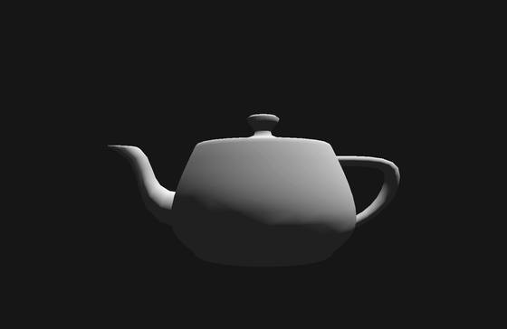

# Computer Project #4: Mouse-Driven Camera Navigation (Vulkan)

A Vulkan-based 3D viewer implementing professional camera navigation interactions — Fit All, Rotate, Pan, Zoom, and Twist — similar to those found in industry-standard 3D applications.

<p align="center">
  
</p>

---

## Controls

| Key | Mode | Mouse Action |
|-----|------|-------------|
| `R` | Rotate | Click + drag — trackball rotation around scene center |
| `P` | Pan | Click + drag — translate camera left/right/up/down |
| `Z` | Zoom | Click + drag up/down — dolly camera in/out |
| `T` | Twist | Click + drag left/right — roll camera around view Z axis |
| `F` | Fit All | *(no mouse needed)* — reframes entire scene in one key press |
| `O` | Toggle | Switch between Perspective and Orthographic projection |

---

## Build & Run (Mac / Linux)

**Prerequisites — fix Windows line endings and compile shaders:**
```bash
sed -i '' 's/\r//' compile-unx.bat
bash compile-unx.bat
```

**Build & Run:**
```bash
make && ./Assignment4
```

---

## Implementation

### Phase 1 — Fit All (`_fitAll`)
Computes the bounding sphere of the loaded scene, calculates the camera-to-scene distance needed for the 50° FOV, and positions the camera so the entire model is visible at the center of the view window. Preserves the current view orientation so Fit All can be called at any time during navigation.

### Phase 2 — Rotate (`_rotate`)
Trackball-style rotation using Rodrigues' formula. The rotation axis is derived from the mouse delta in screen space and mapped to world space via the current view matrix. Rotation always pivots around the scene center using the 5-matrix composition in `setMotion()`.

### Phase 3 — Pan (`_pan`)
Translates the camera in the screen X/Y plane. Pan speed scales proportionally with the current camera distance so it feels consistent across different zoom levels and model sizes.

### Phase 4 — Zoom (`_zoom`)
Dollies the camera along the view −Z axis. Speed is proportional to the current camera distance so zooming feels smooth whether the camera is far away or very close to the model.

### Phase 5 — Twist (`_twist`)
Rotates the camera around the screen Z axis (roll). Horizontal mouse drag maps directly to roll angle, allowing the view to be twisted without affecting the pan or zoom state.

### Phase 6 — Creativity: Isometric Projection Toggle
Pressing `O` switches between **Perspective** and **Orthographic** projection. When switching to Orthographic mode, the camera automatically transitions to the classic **isometric viewpoint** (45° around Y, 35.264° around X), placing the camera equally along all three axes. This lets you compare the same geometry in both projection modes — orthographic removes perspective distortion while perspective conveys depth.

---

## Matrix Composition Design

All interactive operations share the same 5-matrix update formula inside `setMotion()`:

```
new_view = translateOnly * center * rotateOnly * centerInverse * old_view
```

| Matrix | Role |
|--------|------|
| `old_view` | Previous view matrix (m1) |
| `centerInverse` | Shifts scene center to the view origin (m2) |
| `rotateOnly` | Rotation-only part of `m_m4TempTransform` (m3) |
| `center` | Shifts scene center back (m4) |
| `translateOnly` | Translation-only part of `m_m4TempTransform` (m5) |

**Why this works for all modes:**
- For **Rotate / Twist** — `translateOnly = I`, so rotations always pivot around the scene bounding-box center rather than the world origin.
- For **Pan / Zoom** — `rotateOnly = I`, so `center * I * centerInverse` cancels to identity and only the translation is applied.

Decomposing `m_m4TempTransform` into rotation-only and translation-only parts makes the formula work correctly for all four navigation modes without any special-casing.
